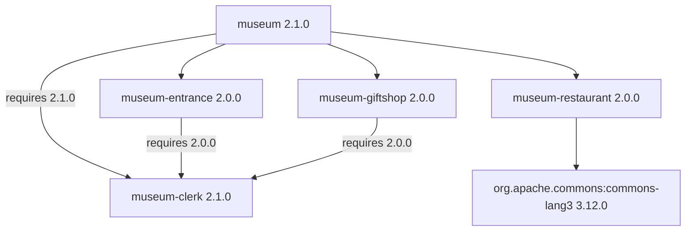

# museum

A small Flix example that combines separate packages into a museum visit. It
demonstrates direct dependencies, a shared transitive dependency with different
minimum version requirements, and a Maven dependency.

The five packages live in separate repositories:

| Package | Role |
| --- | --- |
| `flix/museum` | Coordinates a visit through `Museum.visitMuseum()`. |
| `flix/museum-entrance` | Buys a ticket, calling `Clerk.work()` first. |
| `flix/museum-giftshop` | Buys a gift, calling `Clerk.work()` first. |
| `flix/museum-clerk` | Welcomes visitors through `Clerk.welcomeVisitor()` and provides the shared `Clerk.work()` function. |
| `flix/museum-restaurant` | Buys a meal and declares a Maven dependency on Apache Commons Lang. |

For museum `2.1.0`, the dependency graph selects these package versions. The
clerk edges show each consumer's minimum requirement:



Dependency versions are minimum requirements. Within one major version, Flix
selects the greatest required version of each package. Museum requires clerk
`2.1.0`, while entrance and gift shop remain at `2.0.0` and each still requires
clerk `2.0.0`. All three consumers therefore use clerk `2.1.0` in this build.
The new `Clerk.welcomeVisitor()` function was introduced in clerk `2.1.0`.

Each consumer declares its own dependency mounts. Museum imports `Clerk` with
`use clerk::Clerk` through its direct `clerk` dependency. Entrance and gift shop
each declare their own `clerk` mount. Museum also mounts `entrance`, `giftshop`,
and `restaurant`; its restaurant dependency has `security = "unrestricted"`.

The restaurant declares Apache Commons Lang as a Maven dependency, although its
current source does not use that library.

Calling [`Museum.visitMuseum()`](src/Museum.flix) welcomes the visitor, buys a
ticket, buys a meal, and then buys a gift. A visit produces:

```text
Welcome to the museum!
Clerking...
Entrance.buyTicket() was called.
Museum.Restaurant.buyMeal() was called.
Clerking...
Giftshop.buyGift() was called.
```

Each package has a `src/` directory for its module, a `test/` directory, and a
`flix.toml` manifest. All five manifests specify Flix `0.76.2`. The
`test/TestMain.flix` files are currently empty, and there is no `main` function.
Run a visit from this checkout by selecting the entry point explicitly:

```shell
java -jar flix.jar run --entrypoint Museum.visitMuseum
```

The dependencies in [`flix.toml`](flix.toml) reference versioned GitHub packages.
Checking out the repositories next to each other does not connect their local
sources automatically: changing a sibling checkout alone does not change the
dependency used by this package.

The compiler maintains [`packages.lock`](packages.lock), recording SHA-256
digests of dependency manifests it reads and package archives it downloads.
Version selection follows the manifest requirements; the lockfile verifies
artifact contents. It can record a clerk `2.0.0` manifest read during resolution
even though the selected clerk archive is `2.1.0`.
