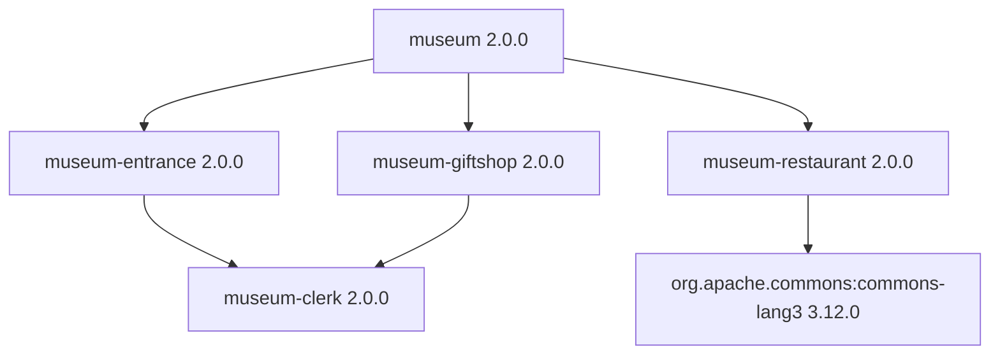

# museum

A small Flix example that combines separate packages into a museum visit. It
demonstrates direct dependencies, a shared transitive dependency, and a Maven
dependency.

The five packages live in separate repositories:

| Package | Role |
| --- | --- |
| `flix/museum` | Coordinates a visit through `Museum.visitMuseum()`. |
| `flix/museum-entrance` | Buys a ticket, calling `Clerk.work()` first. |
| `flix/museum-giftshop` | Buys a gift, calling `Clerk.work()` first. |
| `flix/museum-clerk` | Provides the shared `Clerk.work()` function. |
| `flix/museum-restaurant` | Buys a meal and declares a Maven dependency on Apache Commons Lang. |

The manifests declare the following dependencies:



Both the entrance and gift shop depend on the same version of the clerk package.
The restaurant declares Apache Commons Lang as a Maven dependency, although its
current source does not use that library.

Calling [`Museum.visitMuseum()`](src/Museum.flix) buys a ticket, buys a meal, and
then buys a gift. Each operation currently prints a message. With the sources in
these repositories, a visit produces:

```text
Clerking...
Entrance.buyTicket() was called.
Museum.Restaurant.buyMeal() was called.
Clerking...
Giftshop.buyGift() was called.
```

Each package has a `src/` directory for its module, a `test/` directory, and a
`flix.toml` manifest. All five manifests specify Flix `0.76.2`. The
`test/TestMain.flix` files are currently empty, and there is no `main` function;
`Museum.visitMuseum()` must be called by an entry point supplied by a consumer.

The dependencies in [`flix.toml`](flix.toml) reference versioned GitHub packages.
Checking out the repositories next to each other does not connect their local
sources automatically: changing a sibling checkout alone does not change the
dependency used by this package.
