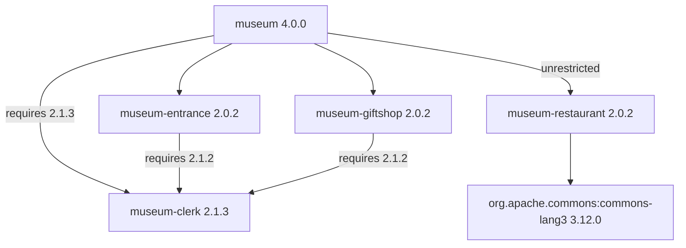

# museum

A small Flix example that combines separate packages into a museum visit. It
demonstrates direct dependencies, a transitive dependency shared by several
packages, package security contexts, and a Maven dependency.

The five packages live in separate repositories:

| Package | Role |
| --- | --- |
| `flix/museum` | Coordinates a visit through `Museum.visitMuseum()`. |
| `flix/museum-entrance` | Buys a ticket, calling `Clerk.work()` first. |
| `flix/museum-giftshop` | Buys a gift, calling `Clerk.work()` first. |
| `flix/museum-clerk` | Welcomes visitors through `Clerk.welcomeVisitor()` and provides the shared `Clerk.work()` function. |
| `flix/museum-restaurant` | Buys a meal and declares a Maven dependency on Apache Commons Lang. |

## Dependency graph

For museum `4.0.0`, the dependency graph selects these package versions. The
clerk edges show each consumer's minimum requirement, and the restaurant edge
shows the security context museum grants it:



Dependency versions are minimum requirements. Within one major version, Flix
selects the greatest required version of each package. Museum requires clerk
`2.1.3`, while entrance and gift shop each still require clerk `2.1.2`. All
three consumers therefore share a single clerk `2.1.3` in this build. The
`Clerk.welcomeVisitor()` function that museum calls was introduced in clerk
`2.1.0`.

Each consumer declares its own dependency mounts. Museum imports `Clerk` with
`use clerk::Clerk` through its direct `clerk` dependency. Entrance and gift shop
each declare their own `clerk` mount. Museum also mounts `entrance`, `giftshop`,
and `restaurant`; its restaurant dependency has `security = "unrestricted"`
because the restaurant declares a Maven dependency.

The restaurant declares Apache Commons Lang as a Maven dependency, although its
current source does not use that library.

## Using the museum

To use the museum from another Flix project, add it to that project's
`flix.toml` and grant it the `unrestricted` security context:

```toml
[dependencies]
"github:flix/museum" = { version = "4.0.0", mount = "museum", security = "unrestricted" }
```

Then import `Museum` through the `museum` mount:

```flix
use museum::Museum

def main(): Unit \ IO = Museum.visitMuseum()
```

The project declares only the museum. Flix fetches entrance, gift shop,
restaurant, and clerk transitively and resolves the restaurant's Maven
dependency.

The `security` field is required. A dependency without it runs in the `plain`
context, but the restaurant's Maven dependency needs `unrestricted`, and museum
cannot grant the restaurant a context it was not given itself. Without the
field, dependency resolution stops with two security violations:

```text
Found security violation in the dependency graph:
  Project 'flix/museum-restaurant' declares Java dependency '"org.apache.commons:commons-lang3" = "3.12.0"' which requires security context 'unrestricted' but only plain was given.

Found security violation in the dependency graph:
  Dependency '"github:flix/museum-restaurant" = { version = "2.0.2", mount = "restaurant", security = "unrestricted" }' of package flix/museum requires security context 'unrestricted' but context 'plain' was given.
```

The compiler warns that raising a dependency's security level can expose a
project to supply chain attacks. The museum needs `unrestricted` only because
of the restaurant's Maven dependency.

## Running a visit from this checkout

Calling [`Museum.visitMuseum()`](src/Museum.flix) welcomes the visitor, buys a
ticket, buys a meal, and then buys a gift. A visit produces:

```text
Welcome to the museum!
Clerking...
Entrance.buyTicket() was called.
Museum.Restaurant.buyMeal() was called.
Clerking...
Giftshop.buyGift() was called.
```

Each package has a `src/` directory for its module, a `test/` directory, and a
`flix.toml` manifest. All five manifests specify Flix `0.76.2`. The
`test/TestMain.flix` files are currently empty, and there is no `main` function.
Run a visit from this checkout by selecting the entry point explicitly:

```shell
java -jar flix.jar run --entrypoint Museum.visitMuseum
```

The dependencies in [`flix.toml`](flix.toml) reference versioned GitHub packages.
Checking out the repositories next to each other does not connect their local
sources automatically: changing a sibling checkout alone does not change the
dependency used by this package.

## Lockfile

The compiler maintains [`packages.lock`](packages.lock), recording SHA-256
digests of dependency manifests it reads and package archives it downloads.
Version selection follows the manifest requirements; the lockfile verifies
artifact contents. It records clerk `2.1.3`, entrance `2.0.2`, gift shop
`2.0.2`, and restaurant `2.0.2`, each with both a `toml` and an `fpkg` digest.
It also records only a `toml` digest for clerk `2.1.2`: the compiler reads that
manifest because entrance and gift shop require it, but downloads only the
selected clerk `2.1.3` archive. The Maven dependency on Apache Commons Lang is
not recorded there.
